# Documento Técnico — Sistema CRUD Call Center KPI
**Actividad 7 · Lenguajes de Programación II · 24 de mayo de 2026**  
**Repositorio:** https://github.com/JuanGonzalezP1021/2026_Proyecyo_Final

---

## 1. Integrantes y responsabilidades

| Integrante | Rama Git | Entidad | Archivo DAO |
|---|---|---|---|
| Juan David González Puentes | `dev_jugonzalez47` | `AgentePhone` | `phone_dao.py` |
| Luna Sahay Guerrero Tarrazona | `dev_lguerrero07` | `AgenteEmail` | `email_dao.py` |
| Lorena Sofia Saavedra Orjueja | `dev_lsaavedra18` | `AgenteChat` | `chat_dao.py` |

---

## 2. Descripción del sistema

Sistema CRUD para gestionar agentes de un call center multicanal con tres tipos de canal: **Phone**, **Chat** y **Email**. Cada agente pertenece a un canal específico y tiene métricas propias calculadas según la definición del negocio (KPIs).

Los datos se persisten en archivos **JSON** independientes por canal, siguiendo el patrón **DAO** (Data Access Object) para desacoplar la lógica de negocio del acceso a datos.

### Características adicionales
- **Paginación en listados:** la opción "Listar agentes" muestra de a 20 registros con navegación interactiva (Enter = siguiente página, q = salir), evitando desbordamiento en terminal.
- **Carga robusta de JSON:** el método `_cargar()` de los DAOs maneja archivos vacíos o corruptos sin caídas (`JSONDecodeError`), devolviendo una lista vacía y permitiendo operar normalmente.
- **Validación de entrada:** funciones `leer_float()` y `leer_int()` previenen caídas por input inválido del usuario.

---

## 3. Arquitectura — Patrón MVC + DAO

```
2026_Proyecyo_Final/
├── modelo/                  ← CAPA MODELO (M en MVC)
│   ├── agente_phone.py      → Entidad AgentePhone
│   ├── agente_chat.py       → Entidad AgenteChat
│   └── agente_email.py      → Entidad AgenteEmail
├── repositorio/             ← CAPA DAO
│   ├── phone_dao.py         → CRUD sobre phone_data.json
│   ├── chat_dao.py          → CRUD sobre chat_data.json
│   └── email_dao.py         → CRUD sobre email_data.json
├── tests/                   ← PRUEBAS UNITARIAS
│   ├── test_phone_crud.py
│   ├── test_chat_crud.py
│   └── test_email_crud.py
├── data/                    ← PERSISTENCIA JSON
├── docs/                    ← DOCUMENTACIÓN
│   └── taller_VII.md
└── main.py                  ← CONTROLADOR (C en MVC)
```

| Capa | Rol | Archivos |
|---|---|---|
| **Model** | Define entidades y atributos | `modelo/agente_*.py` |
| **View** | Menú en consola | `main.py` (funciones menú) |
| **Controller** | Recibe opción y llama al DAO | `main.py` (función main) |

---

## 4. Diagrama de clases

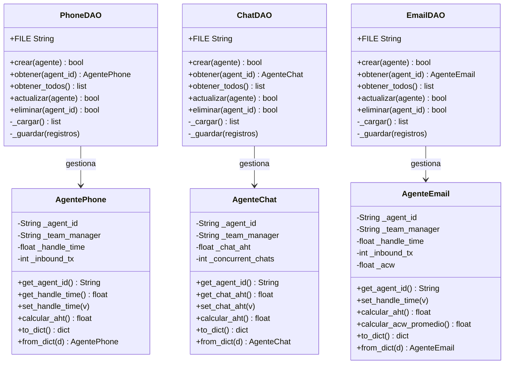

---

## 5. Entidades del sistema

### AgentePhone
AHT = `Handle_Time / Inbound_Transactions`  
Edge case: si `inbound_tx == 0` retorna `0.0` — evita división por cero.

### AgenteChat
AHT = `Dual/Multiple_Chat_AHT` (ya calculado por el sistema)  
Edge case: `chat_aht` puede ser `0.0` si no ha gestionado chats.

### AgenteEmail
AHT = `Handle_Time / Inbound_Transactions`  
ACW promedio = `ACW / Inbound_Transactions`  
Edge case: si `inbound_tx == 0` retorna `0.0` en ambas métricas.

---

## 6. Operaciones CRUD

| Operación | Método | Comportamiento |
|---|---|---|
| **Create** | `crear(agente)` | Guarda nuevo. `False` si ya existe. |
| **Read** | `obtener(agent_id)` | Busca por ID. `None` si no existe. |
| **Read All** | `obtener_todos()` | Lista todos los agentes del canal (paginado de a 20). |
| **Update** | `actualizar(agente)` | Actualiza datos. `False` si no existe. |
| **Delete** | `eliminar(agent_id)` | Elimina por ID. `False` si no existe. |

---

## 7. Principios SOLID aplicados

| Principio | Aplicación en el proyecto |
|---|---|
| **S** — Single Responsibility | Cada clase tiene una sola responsabilidad: la entidad modela datos, el DAO persiste, el main controla el flujo. |
| **O** — Open/Closed | Los DAOs pueden extenderse a SQLite cambiando solo `_cargar()` y `_guardar()` sin tocar entidades ni pruebas. |
| **L** — Liskov Substitution | Las 3 entidades tienen la misma interfaz (`to_dict`, `from_dict`, `calcular_aht`) y son intercambiables. |
| **I** — Interface Segregation | Cada DAO expone solo los métodos que su entidad necesita. |
| **D** — Dependency Inversion | Las pruebas dependen de la interfaz del DAO, no de la implementación interna del JSON. |

---

## 8. Pruebas unitarias — 10 casos por integrante

| # | Caso | Tipo |
|---|---|---|
| 1 | Crear agente nuevo exitosamente | Normal |
| 2 | Crear agente duplicado → `False` | **Edge** |
| 3 | Leer agente existente por ID | Normal |
| 4 | Leer agente con ID inexistente → `None` | **Edge** |
| 5 | Actualizar atributo de agente existente | Normal |
| 6 | Actualizar agente que no existe → `False` | **Edge** |
| 7 | Eliminar agente existente | Normal |
| 8 | Eliminar agente inexistente → `False` | **Edge** |
| 9 | Listar todos con múltiples agentes | Normal |
| 10 | AHT con `inbound_tx = 0` → `0.0` | **Edge** |

### Resultado de pruebas — Dev 1: Phone (J.Gonzalez)

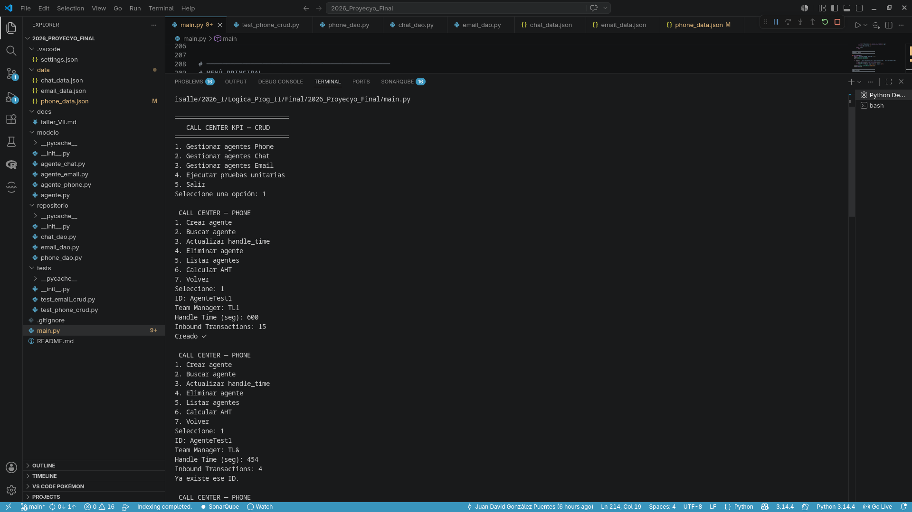

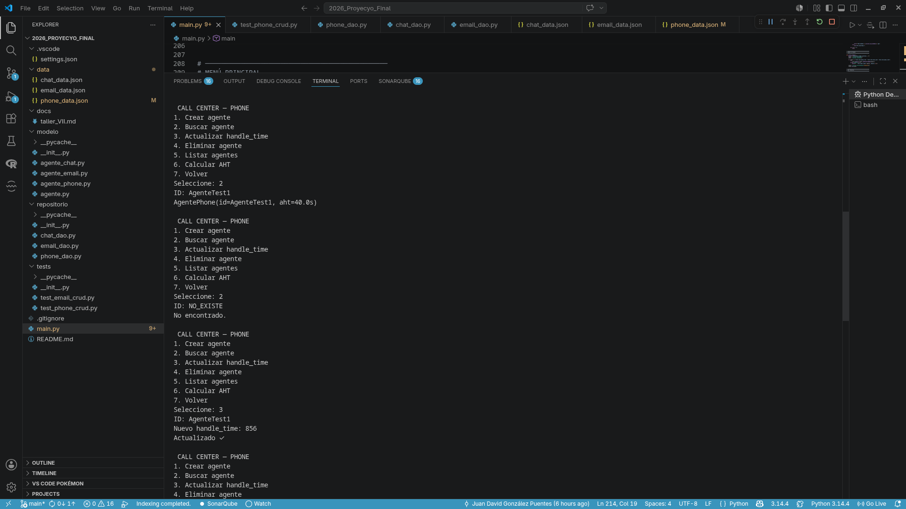

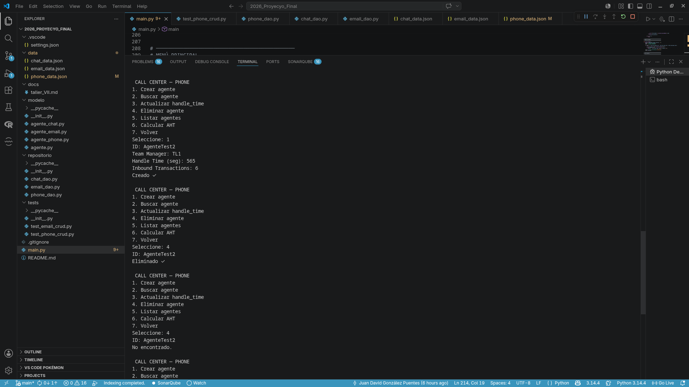

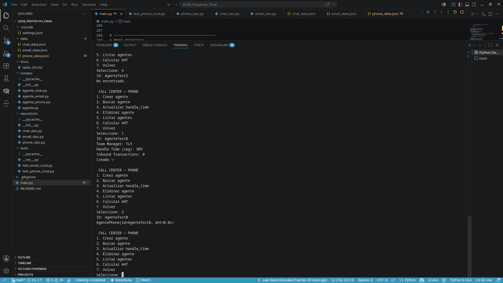

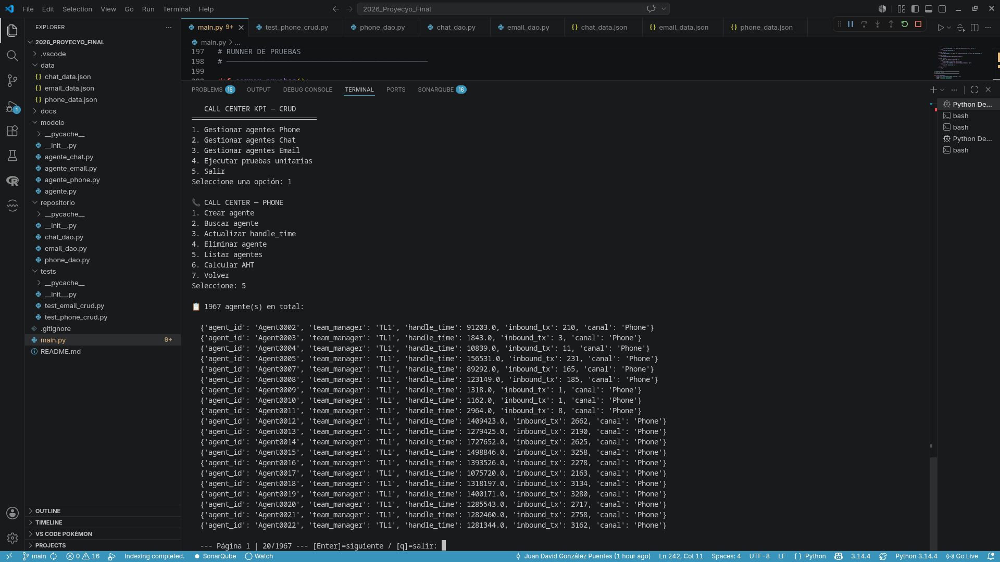

### Resultado de pruebas — Dev 2: Chat (L. Saavedra)


.

### Resultado de pruebas — Dev 3: Email (L. Guerrero)

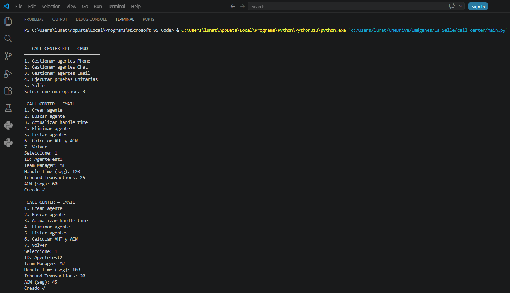

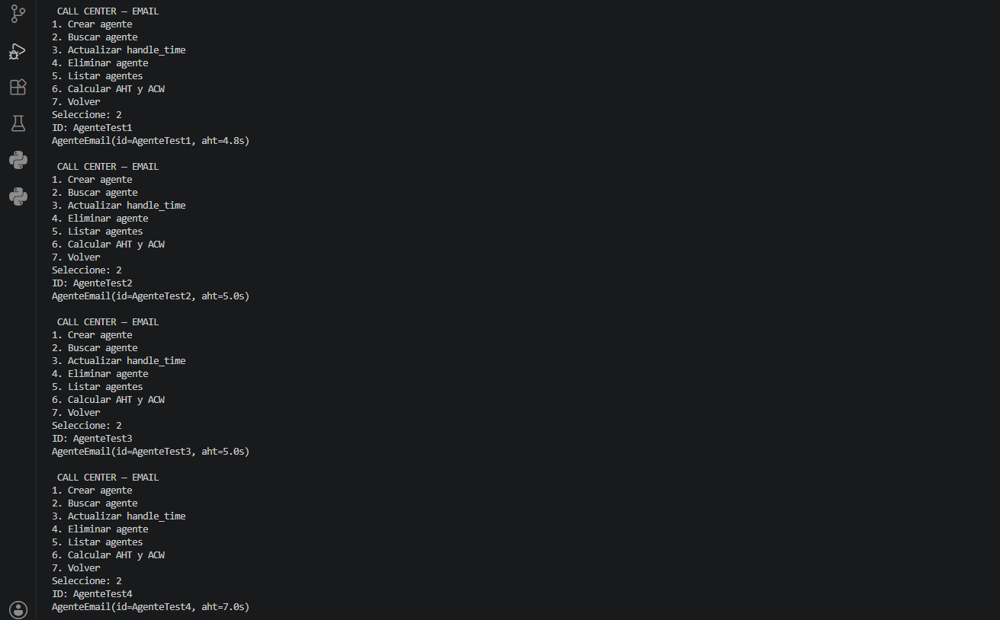

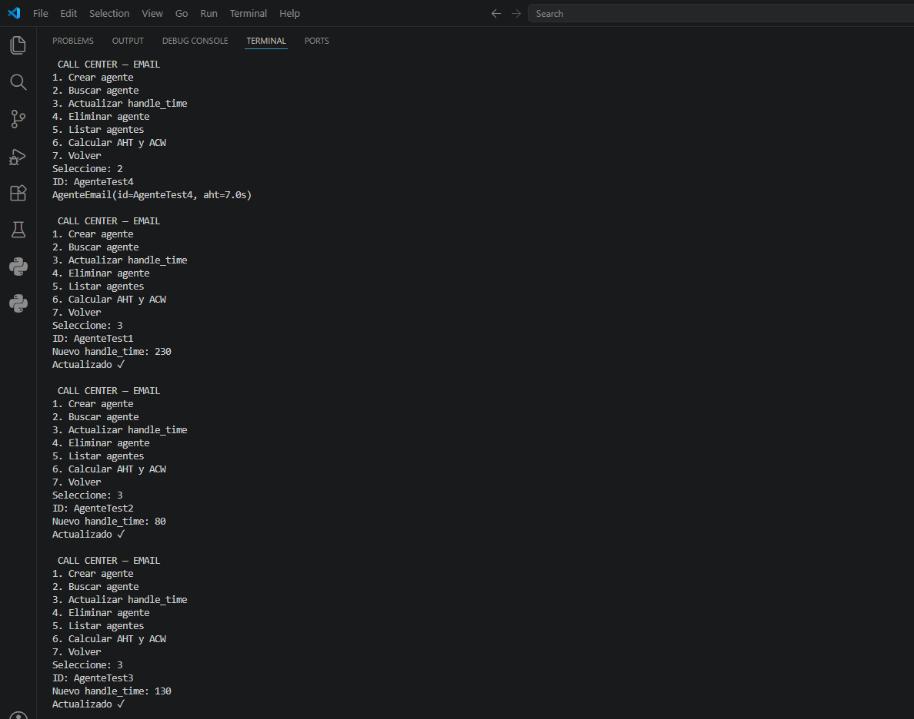

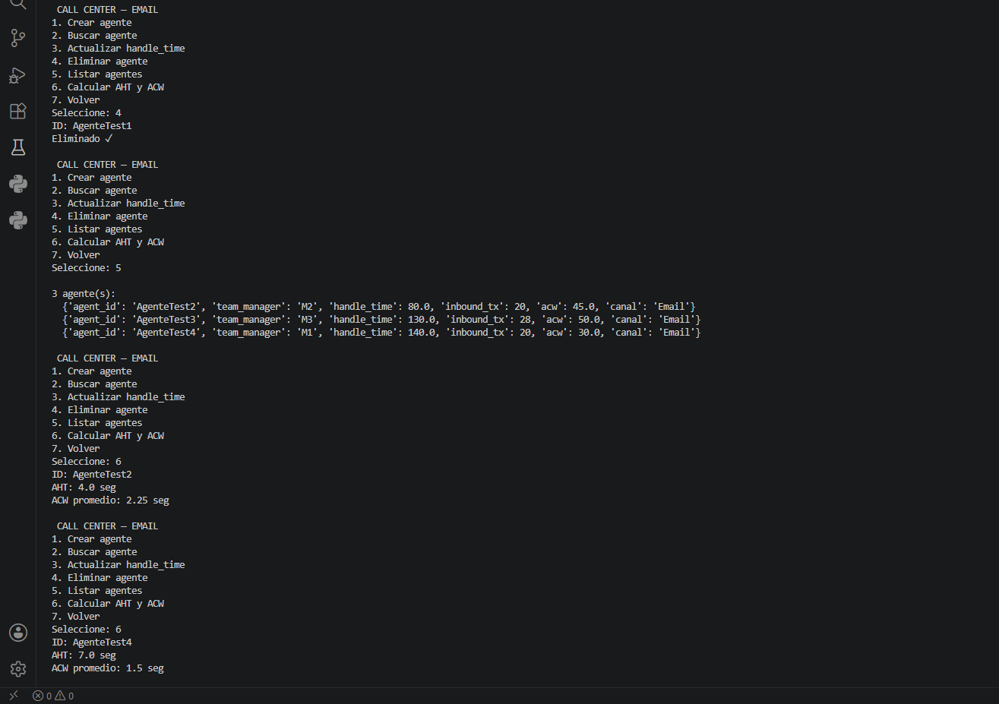

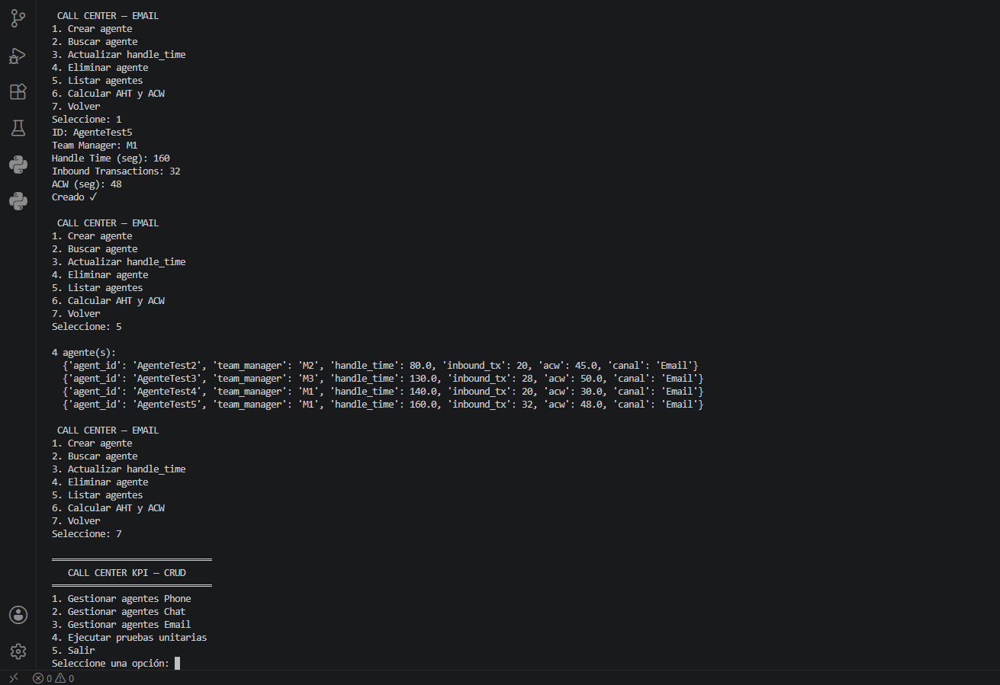

---

## 9. Ejecución

```bash
# Menú principal
python3 main.py

# Pruebas por canal
python -m unittest tests/test_phone_crud.py -v
python -m unittest tests/test_chat_crud.py -v
python -m unittest tests/test_email_crud.py -v

# O desde el menú → opción 4
```

---

## 10. Flujo Git

```
main
 └── develop
      ├── dev_jugonzalez47   → AgentePhone + PhoneDAO + test_phone_crud
      ├── dev_lguerrero07    → AgenteChat  + ChatDAO  + test_chat_crud
      └── dev_lsaavedra18    → AgenteEmail + EmailDAO + test_email_crud
```

---
*Lenguajes de Programación II · Universidad de La Salle · 2026*
